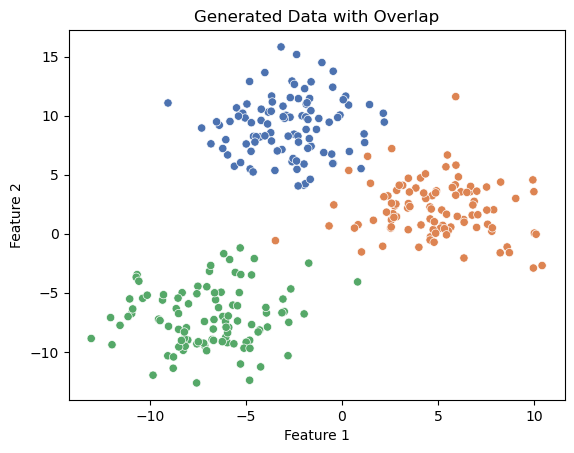
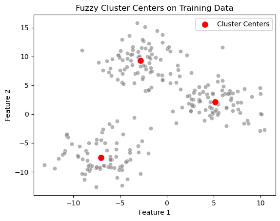
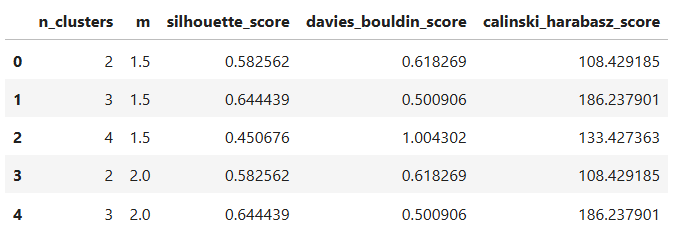
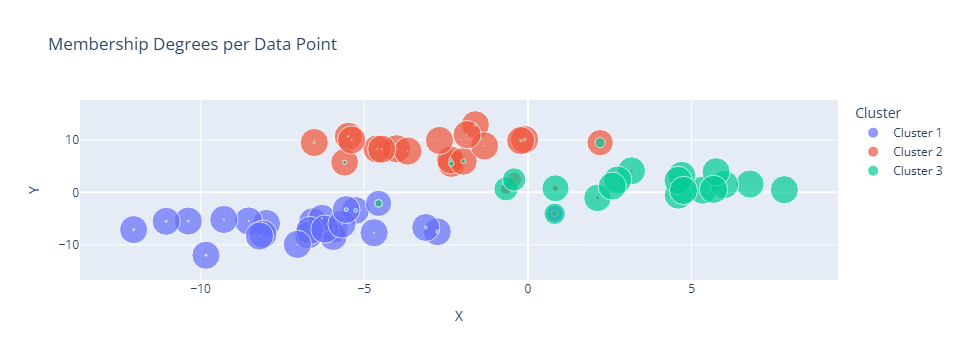

Usage
======================

Generating Synthetic Dataset
----------------------------

.. code-block:: python

    from sklearn.datasets import make_blobs
    import matplotlib.pyplot as plt
    import seaborn as sns
    import pandas as pd
    import numpy as np

    # Generate synthetic dataset with overlapping clusters
    X, y_true = make_blobs(
        n_samples=300,
        centers=3,
        cluster_std=2.5,  # Increased std for overlap
        random_state=42,
    )

    # Visualize the dataset
    sns.scatterplot(x=X[:, 0], y=X[:, 1], hue=y_true, palette="deep", legend=None)
    plt.title("Generated Data with Overlap")
    plt.xlabel("Feature 1")
    plt.ylabel("Feature 2")
    plt.show()

Splitting Data into Training and Validation Sets
------------------------------------------------

.. code-block:: python

    from sklearn.model_selection import train_test_split

    # Split data into training and validation sets
    X_train, X_val = train_test_split(X, test_size=0.2, random_state=42)

Fitting Fuzzy C-Means Model
---------------------------

.. code-block:: python

    # Initialize and fit the Fuzzy C-Means model
    fcm = FuzzyCMeans(n_clusters=3, m=2, random_state=42)
    fcm.fit(X_train)

    # Visualize the fuzzy cluster centers
    sns.scatterplot(x=X_train[:, 0], y=X_train[:, 1], color="gray", alpha=0.6)
    sns.scatterplot(
        x=fcm.cluster_centers_[:, 0],
        y=fcm.cluster_centers_[:, 1],
        color="red",
        s=100,
        label="Cluster Centers",
    )
    plt.title("Fuzzy Cluster Centers on Training Data")
    plt.xlabel("Feature 1")
    plt.ylabel("Feature 2")
    plt.legend()
    plt.show()

Performing Hyperparameter Tuning
--------------------------------

.. code-block:: python

    from sklearn.model_selection import ParameterGrid
    from sklearn.metrics import (
        silhouette_score,
        davies_bouldin_score,
        calinski_harabasz_score,
    )
    import numpy as np

    # Define hyperparameter grid
    param_grid = {"n_clusters": [2, 3, 4], "m": [1.5, 2, 2.5]}

    results = []

    # Perform grid search
    for params in ParameterGrid(param_grid):
        fcm = FuzzyCMeans(n_clusters=params["n_clusters"], m=params["m"], random_state=42)
        fcm.fit(X_train)

        # Predict membership on validation data
        U_val = fcm._compute_memberships(X_val)
        y_pred = U_val.argmax(axis=1)

        # Evaluate clustering performance
        silhouette = silhouette_score(X_val, y_pred)
        davies_bouldin = davies_bouldin_score(X_val, y_pred)
        calinski_harabasz = calinski_harabasz_score(X_val, y_pred)

        results.append(
            {
                "n_clusters": params["n_clusters"],
                "m": params["m"],
                "silhouette_score": silhouette,
                "davies_bouldin_score": davies_bouldin,
                "calinski_harabasz_score": calinski_harabasz,
            }
        )

Selecting the Best Parameters
-----------------------------

.. code-block:: python

    # Select best parameters
    best_params = results_df.sort_values("silhouette_score", ascending=False).iloc[0]
    fcm_best = FuzzyCMeans(
        n_clusters=int(best_params["n_clusters"]), m=best_params["m"], random_state=42
    )
    fcm_best.fit(X_train)

    # Predict memberships for the validation data
    U_val_best = fcm_best._compute_memberships(X_val)
    y_pred_best = U_val_best.argmax(axis=1)

    # Evaluate using all metrics
    silhouette = silhouette_score(X_val, y_pred_best)
    davies_bouldin = davies_bouldin_score(X_val, y_pred_best)
    calinski_harabasz = calinski_harabasz_score(X_val, y_pred_best)

    print(f"Silhouette Score: {silhouette:.3f}")
    print(f"Davies-Bouldin Index: {davies_bouldin:.3f}")
    print(f"Calinski-Harabasz Index: {calinski_harabasz:.3f}")

Result Explanation
------------------

1. **Silhouette Score (0.644)**
--------------------------------
   - **What it measures**: 
     The silhouette score evaluates how well clusters are separated and how compact they are. It ranges from **-1 to 1**, where:
     
     - **+1** indicates well-defined clusters (points are closer to their cluster than others).
     - **0** indicates overlapping clusters.
     - **-1** indicates incorrect clustering.

   - **Interpretation**: 
     A score of **0.644** suggests that the clusters are fairly well-separated and compact, indicating that the Fuzzy C-Means algorithm is performing reasonably well.

2. **Davies-Bouldin Index (0.501)**
-----------------------------------
   - **What it measures**: 
     This index evaluates cluster separation and compactness. Lower values indicate better clustering.

   - **Interpretation**: 
     A value of **0.501** is relatively low, showing that the clusters are compact and well-separated, reinforcing the conclusion that the clustering is effective.

3. **Calinski-Harabasz Index (186.238)**
-----------------------------------------
   - **What it measures**: 
     This index evaluates the ratio of between-cluster dispersion to within-cluster dispersion. Higher values indicate better clustering.

   - **Interpretation**: 
     A value of **186.238** is relatively high, suggesting that the clusters are well-separated and the data points within each cluster are close together.

---

**Overall Interpretation**

The evaluation metrics indicate that:

1. The **Silhouette Score** and **Davies-Bouldin Index** confirm good cluster quality.
2. The **Calinski-Harabasz Index** highlights strong separation between clusters and compactness within clusters.

These metrics collectively suggest that Fuzzy C-Means effectively handled the overlapping data and produced meaningful, distinguishable clusters. However, further analysis of the membership degrees could provide deeper insights into the soft clustering behavior, especially in regions where clusters overlap.

Visualizing Membership Degrees
------------------------------

.. code-block:: python

    import plotly.express as px

    # Convert membership matrix to long format
    df_membership = pd.DataFrame(
        U_val_best, columns=[f"Cluster {i+1}" for i in range(fcm_best.n_clusters)]
    )
    df_membership["Max Cluster"] = df_membership.idxmax(axis=1)
    df_membership["X"] = X_val[:, 0]
    df_membership["Y"] = X_val[:, 1]

    # Long format for interactive plot
    df_membership_long = df_membership.melt(
        id_vars=["X", "Y", "Max Cluster"],
        value_vars=[f"Cluster {i+1}" for i in range(fcm_best.n_clusters)],
        var_name="Cluster",
        value_name="Membership Degree",
    )

    # Interactive plot
    fig = px.scatter(
        df_membership_long,
        x="X",
        y="Y",
        color="Cluster",
        size="Membership Degree",
        title="Membership Degrees per Data Point",
        labels={"Membership Degree": "Degree"},
    )
    fig.show()

